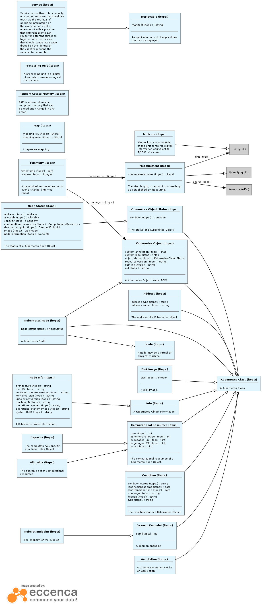

# BRAINE Vocabulary

The BRAINE ontology consists of vocabularies for describing services, devices, workflows and constraints.

Agenda

- (WHERE) Define an abstract vocabulary for instance-inventory description (hardware and software) 
- (WHAT) Define an abstract vocabulary for service description
- (HOW and WHEN) Define an abstract vocabuary for workflow execution (service orchestration)
